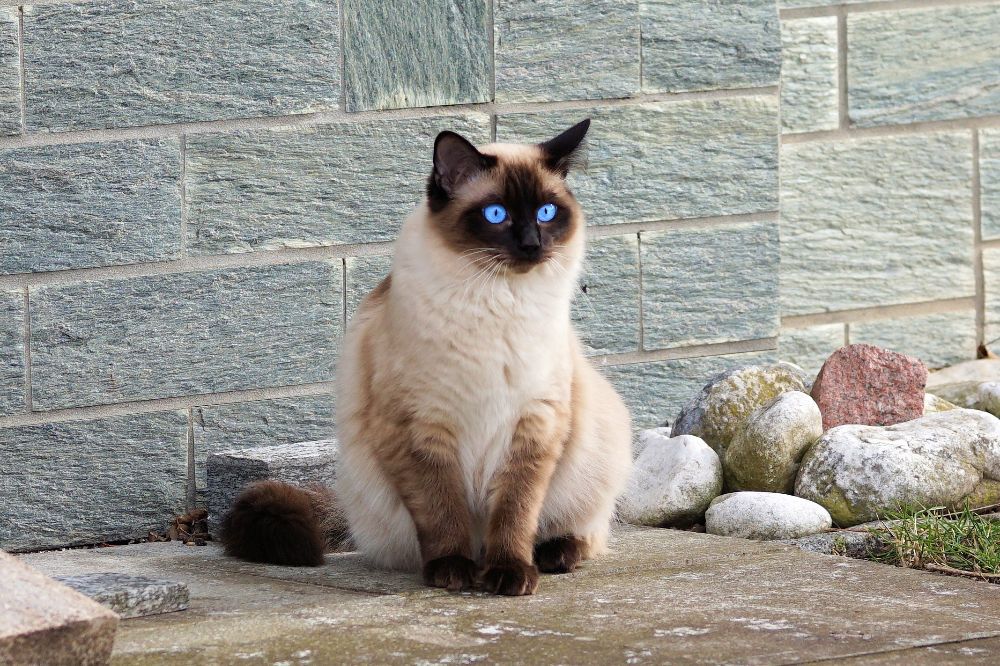

# Structs and Interfaces



Before we begin to dig into structs and interface, let's go over some quick basics about go.

- Public variables and functions start with a captial letter.
- Private variables and functions start with a lowercase letter.
- All files within a folder are required to be part of the same package.
- All files within a package have access to any private variables or functions defined in the package.
- Test files are denoted with `_test` as a suffix in the file name.
- Variables can be defined one of two ways

```go
//Using var and declaring the type. This can be used anywhere in your code.
var name string = "Sally"

//Dynamically determining the type. This must be done inside of a function.
name := "Sally"
```

## Structs

Structs are used to create complex types in Go. They can:

- Contain zero or more attributes
- Be public or private
- Contain a mixture of public and private attributes
- Contain a mixture of attribute types, including other structs

Let's examine the `Cat` struct in `tutorial/cat/cat.go`.

```go
type Cat struct {
	Name        string `json:"name"`
	Breed       string `json:"breed"`
	Personality string `json:"personality"`
	Available   bool   `json:"available"`
}
```
Every instance of `Cat` will have these four attributes. If any of their attributes are not set, they will use their default values. This allows us to be able to reliably use any attribute of `Cat` without having to check for it's existence.

Now what if we wanted to have multiple `Cat`s? We can define a new type, `Cats` and set it to have a `slice` of `Cat`s. A `slice` in Go is similar to an array, but it does not have a set size.

```go
type Cats struct {
	List []*Cat `json:"cats"`
}
```

You'll notice an `*` by `Cat`. This means that `Cats.List` is a `slice` of `Cat` pointers. This is important as that will allow us to update the values of any individual `Cat`. If we had set it to the value instead, we would be unable to modify a `Cat`.

## Interfaces

`Interfaces` are a way of abstracting your code. Imagine we wanted to run not just a Cat Cafe, but a Dog and Cat cafe. Many of the functions we'd need to write on a `Dog` struct would be the same. However; as Go is a typed language, it cannot directly use two different `structs` for the same purpose.

This is where `interfaces` come in. Instead of specifying we're expecting to use a `Cat` we can instead use an `interface` that abstracts our `structs` by letting us specify what functions we care about.

```go
type List interface {
	GetByPersonality(personality string) *Cats
}
```

In our code we've defined the `List` interface, which implements a single function, `GetByPersonality`. Go will automatically apply the interface to any struct that has a function named `GetByPersonality` that takes in a single `string` argument and returns a pointer to a `*Cat` struct.

## Task One - Filter Cats by Personality

If you look at `tutorial/cat/data.go` you will see the full list of cats at our Cat Cafe. You'll notice that each cat has a `Personality`.

We will be updating `GetByPersonality` to return a filtered list of cats, which is restricted to the personality that was passed in. 

First, let's examine our test: `/tutorial/cat/cat_test.go`. We can run this test using the command `go test ./...`. You will see that the test is currently failing as the function returns too many results.

Back to `GetByPersonality`. As this function is defined on the `Cats` struct, we can loop through the `List` and return a subset of cats that we care about.

You can loop in go using the `range` operator in a `for` loop, which returns two variables: the index and the current item.

```go
for index, item := range List{

}
```

We can check if the personality matches using an `if` statement.

```go
if myVar == "value" {

}
```

We can also create a new instance of cats and append the cats we want to it's list.

```go
result := Cats{}
cat := &Cat{}
result.List = append(result.List, cat)
```

Try using these concepts to update `GetByPersonality` so all of the tests pass. Completely stuck? Check out `complete/cat/cat.go` for the finished version of the function.

**NOTE** Don't need a variable that comes back from a function or loop? Use `_` as the variable name to let the compiler know you won't be using it.

[Part Two - Building a Simple REST Server](REST.md)